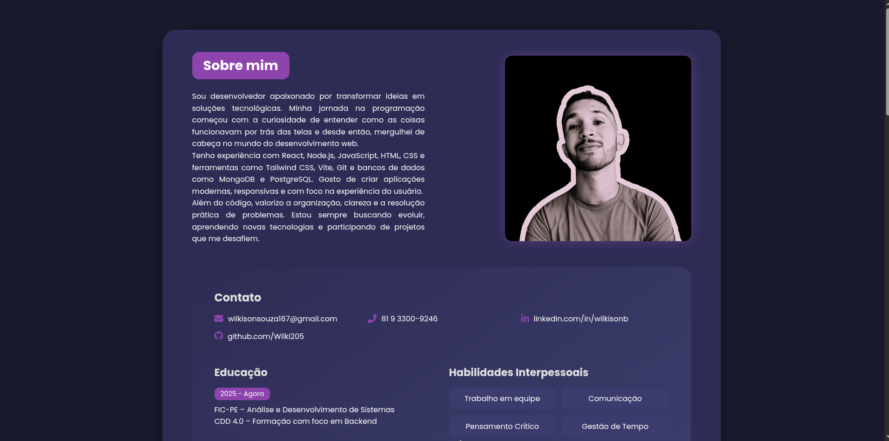

# Portfólio Pessoal | Wilker Santos


## 📄 Descrição

Este é o repositório do meu portfólio pessoal, um projeto desenvolvido para apresentar minhas habilidades, experiências e os projetos nos quais trabalhei. O site foi criado com o objetivo de ser meu cartão de visitas digital para recrutadores e outros profissionais da área de tecnologia.

---

### 🚀 Deploy

O projeto está disponível para visualização online através do GitHub Pages.

**➡️ [Acesse o Portfólio aqui!](https://wilki205.github.io/Portif-lio/)**

*(O link acima já deve funcionar se o seu GitHub Pages estiver ativado. Se não, basta ativar nas configurações do repositório)*

---

### 🖼️ Screenshot




---

### ✨ Funcionalidades

* **Design Totalmente Responsivo**: O layout se adapta perfeitamente a desktops, tablets e celulares.
* **Animações Dinâmicas**: Efeitos de animação ao rolar a página, implementados com a biblioteca `ScrollReveal.js`.
* **Efeito de Digitação**: Animação de texto na seção inicial para apresentar minhas especialidades, utilizando `Typed.js`.
* **Navegação Intuitiva**: Menu de navegação que destaca a seção ativa e permite rolagem suave entre as seções.
* **Seções Completas**:
    * **Início**: Apresentação inicial.
    * **Sobre**: Detalhes sobre minha trajetória e paixão por tecnologia.
    * **Habilidades**: Ícones e listas com as tecnologias que eu domino.
    * **Projetos**: Cards para exibir meus principais trabalhos.
    * **Contato**: Informações e links para minhas redes sociais.

---

### 🛠️ Tecnologias Utilizadas

Este projeto foi construído utilizando as seguintes tecnologias e ferramentas:

* **HTML5**: Para a estrutura semântica do site.
* **CSS3**: Para estilização, layout flexbox e design responsivo.
* **JavaScript**: Para a interatividade e manipulação do DOM.

#### Bibliotecas JavaScript:

* **[Typed.js](https.github.com/mattboldt/typed.js/)**: Para criar o efeito de digitação animado.
* **[ScrollReveal.js](https://scrollrevealjs.org/)**: Para animar elementos na entrada ao rolar a página.
* **[Boxicons](https://boxicons.com/)**: Biblioteca de ícones vetoriais de alta qualidade.

---

### ⚙️ Como Executar o Projeto Localmente

Não há necessidade de dependências complexas. Para rodar este projeto em sua máquina, siga os passos:

1.  **Clone o repositório:**
    ```bash
    git clone [https://github.com/Wilki205/Portif-lio.git](https://github.com/Wilki205/Portif-lio.git)
    ```

2.  **Navegue até o diretório do projeto:**
    ```bash
    cd Portif-lio
    ```

3.  **Abra o arquivo `index.html`:**
    Basta abrir o arquivo `index.html` no seu navegador de preferência.

---

### 📫 Contato

**Wilker Santos**

* **LinkedIn**: (https://www.linkedin.com/in/wilkisonb/)
* **GitHub**: (https://github.com/Wilki205)
